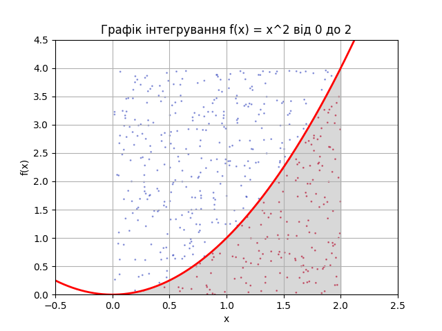

# Homework Conclusions: Linear Programming & Monte Carlo

## Task 1: Production Optimization

The Linear Programming model (using PuLP) successfully identified the optimal production plan to maximize total output under resource constraints.

**Result:** 30 units of Lemonade and 20 units of Fruit Juice.

**Total Production:** 50 units.

**Conclusion:** The algorithm correctly utilized the limiting resources (Lemon Juice and Fruit Puree) to achieve the mathematically maximum production volume. The solution is optimal.

## Task 2: Monte Carlo Integration

The Monte Carlo method was used to calculate the integral of f(x) = x² over the interval [0, 2].

**Monte Carlo Result:** 2.67

**Analytical Result (quad):** ~2.667

**Absolute Error:** 0.0033

**Conclusion:** The stochastic Monte Carlo approach yielded a result extremely close to the exact analytical solution. The minor error demonstrates the method's high accuracy and effectiveness for numerical integration.

